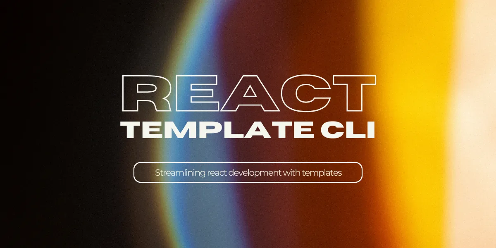

# React-Template-CLI (rtc)

rtc is a template driven cli tool for react development.

**Build your own component library!**\
Generate component templates from your existing component files, or use generic out of the box templates when creating new components!

rtc helps you get a new project up and running in no time by reusing different parts of former projects!\
For example: <b>Easily reuse the mobile header from your last application without having to reinvent the wheel!</b>

### Requirements

- cmake standard >= 3.25

### Installation

```bash
git clone git@github.com:yannickbohrer/react-template-cli.git
cd react-template-cli
cmake -S . -B build
cmake --build build
sudo cmake --install build
```

### Syntax

`rtc [activity] [type] [path] [--flags]`

### Usage

`[]` indicate optional parameter

- `rtc generate component path/to/MyComponent [--test] [--ts] [--css] [--template=CustomComponentTemplate] [--styles=CustomStylesTemplate]`
- `rtc add template path/to/MyExistingFile`
- `rtc remove template MyTemplate`
- `rtc list template`
- `rtc rename template OldTemplateName NewTemplateName`
- `rtc print history`
- `rtc clear history`
- `rtc help`

#### Flags:

- `--css`: Dedicated empty css file for component will be generated at component location. Note: This flag is independent from the --styles flag.
- `--template=CustomComponentTemplate`: Use custom template for component generation. If not set: Standard template will be used.
- `--styles=CustomStylesTemplate`: Use selected custom styles template to generate styles file. Note: This flag is independent from the --css flag.
- `--ts`: Create .tsx component instead of (standard) .jsx. Test file (if generated) will adjust as well.
- `--test`: Generate test file along with component. Will use or create (if not existent) test dir at component location.

### Important:

- When adding a template file, the component name has to include the file name (without file extension) exactly.
- Providing file extensions in `--template=MyTemplate` flag, `remove template MyTemplate` or `rename template MyTemplate NewName` is optional.
- The template file extension cannot be changed through renaming a template file.
- --css and --styles are independent from one another. If both are set, two files will be generated. One empty one and one with the selected custom template.

#### Assets Directory:

```bash
~/.rtc/
```
